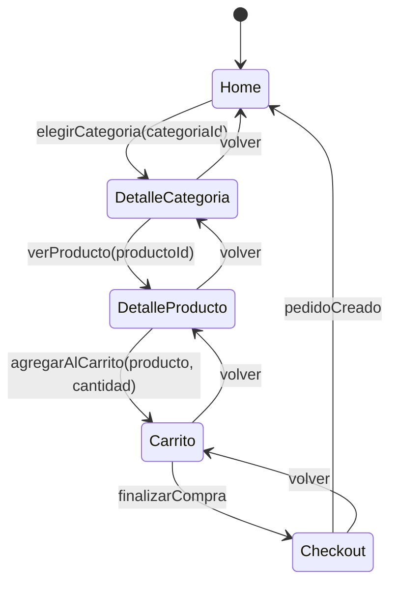

# Reporte P2 — Maquetado del Flujo E-commerce (NexoPlay)

**Práctica P2-6** — Programación Web 2 · Parcial 2 · Semana 2  
**Modalidad:** Individual  
**Fecha:** Septiembre 2026  
**Autor:** [Tu Nombre / Legajo]  
**Repositorio:** `p26-front` (React + Vite) + `p26-back` (Node + Apollo Server)

---

## 1. Portada

| Dato | Valor |
|------|-------|
| **Materia** | Programación Web 2 (PWII) |
| **Práctica** | P2-6 — Flujo e-commerce + Backend GraphQL |
| **Proyecto** | NexoPlay |
| **Frontend** | React 19 + Vite (JavaScript) |
| **Backend** | Node.js + Apollo Server 5 + SQLite |
| **Entrega** | Dos zips: `p26-codigo.zip` + `p26-reportes.zip` |

---

## 2. Marco Teórico

### 2.1 Componentes
La aplicación sigue el **diseño atómico** (Brad Frost) adaptado a React:
- **Átomos:** `ImagenProducto`, `Skeleton` (`SkeletonGrid`, `SkeletonDetalle`), `ErrorMessage`, `SelectorCantidad` (inline), `Botón`, `Input`, `Label`.
- **Moléculas:** `ProductoCard`, `Sidebar`, `TopBar`, `Hero`, `ContextBar`, `Footer`, `CarritoItem`.
- **Organismos:** `GridProductos`, `ListaCarrito`, `FormularioCheckout`.
- **Templates (pantallas del flujo):** `Home`, `DetalleCategoria`, `DetalleProducto`, `Carrito`, `Checkout`.

Cada componente es **reutilizable**, tiene **responsabilidad única** y se comunica vía **props** (padre → hijo) o **eventos custom** (hijo → padre).

### 2.2 Props y Estado
- **Props de solo lectura** bajan datos y callbacks (`onElegirCategoria`, `onVerProducto`, `onAgregarAlCarrito`, `onFinalizarCompra`, `onVolver`, `onPedidoCreado`).
- **Estado local** (`useState`) en templates para datos de formulario, carga, error, paginación.
- **Estado global** del flujo: máquina de estados en `App.jsx` (`useReducer` + `useTransition`) que decide qué template renderizar y lleva `categoriaId`, `productoId`, `busqueda`.
- **Estado compartido (carrito):** `CarritoContext` (Context API) provee `items`, `totalItems`, `totalPrecio`, `agregarAlCarrito`, `quitarDelCarrito`, `actualizarCantidad`, `vaciarCarrito`. Lo consumen `TopBar` (contador), `DetalleProducto` (agregar), `Carrito` (listar/editar/quitar), `Checkout` (leer + vaciar).

### 2.3 Eventos
- **HTML nativos:** `onClick`, `onChange`, `onSubmit`, `onBlur` en formularios y botones.
- **Custom (callback props):** burbujean desde templates hacia `App` para mutar el estado de la máquina (`elegirCategoria`, `verProducto`, `agregarAlCarrito`, `finalizarCompra`, `pedidoCreado`, `volver`).

### 2.4 Máquina de Estados
El flujo **no usa URLs**; un `estado.pantalla ∈ { 'home', 'categoria', 'producto', 'carrito', 'checkout' }` controla qué template se monta.



`useTransition` evita bloqueos al cambiar de pantalla mientras se fetchean datos.

### 2.5 Context API (vs Zustand)
Se eligió **Context API** (Tema 6/11 del recurso Vite) para el carrito:
- `CarritoProvider` envuelve todo el layout en `App.jsx`.
- `useCarrito()` hook de acceso tipado con guardas.
- Ventaja: cero dependencias extra, React nativo, suficiente para el alcance.
- `TopBar`, `DetalleProducto`, `Carrito`, `Checkout` leen/escriben sin drilling.

### 2.6 Diseño Atómico y Estilos
- **Tokens CSS** (`styles/tokens.css`): colores, espaciado, tipografía, radios, sombras.
- **CSS modular** por componente (`index.css` con bloques comentados).
- **Responsivo:** breakpoints en 700px/800px; grid `auto-fill/minmax` para catálogo.
- **Accesibilidad:** `aria-label`, `aria-invalid`, `aria-describedby`, `role="alert"`, focus visible.

### 2.7 Fetching y Skeletons (Temas 7 y 14)
- Cliente GraphQL genérico `graphqlRequest(endpoint, query, variables)` con `fetch` + manejo de `errors[]`.
- Cada template que consulta datos tiene trio `cargando / error / datos`.
- **Skeletons** animados (`SkeletonGrid` en Home/DetalleCategoria, `SkeletonDetalle` en DetalleProducto/Checkout) en lugar de spinners genéricos.

### 2.8 Keys y Fragment
- `key={producto.id}` / `key={item.producto.id}` en todos los `.map()`.
- `<>...</>` (Fragment) en `DetalleProducto` y `Home` para agrupar sin nodo extra.

### 2.9 Lint
- `oxlint` configurado (`npm run lint`): cero errores, solo warnings preexistentes (Fast Refresh, setState en effect).

---

## 3. Diseño UML — Diagrama de Componentes

```mermaid
graph TD
    subgraph Atomos["Átomos"]
        ImagenProducto[ImagenProducto]
        Skeleton[Skeleton<br/>(SkeletonGrid, SkeletonDetalle)]
        ErrorMessage[ErrorMessage]
        SelectorCantidad[SelectorCantidad<br/>(inline)]
        Boton[Botón / Input / Label]
    end

    subgraph Moleculas["Moléculas"]
        ProductoCard[ProductoCard]
        Sidebar[Sidebar]
        TopBar[TopBar]
        Hero[Hero]
        ContextBar[ContextBar]
        Footer[Footer]
        CarritoItem[CarritoItem]
    end

    subgraph Organismos["Organismos"]
        GridProductos[Grid de Productos]
        ListaCarrito[Lista del Carrito]
        FormularioCheckout[Formulario Checkout]
    end

    subgraph Templates["Templates (Pantallas del flujo)"]
        Home[Home]
        DetalleCategoria[DetalleCategoria]
        DetalleProducto[DetalleProducto]
        Carrito[Carrito]
        Checkout[Checkout]
    end

    subgraph EstadoGlobal["Estado global / Máquina de estados"]
        Flujo[Flujo (useReducer + useTransition)]
        CarritoCtx[CarritoContext<br/>(Provider + useCarrito)]
    end

    subgraph Datos["Capa de datos"]
        GraphQLClient[graphqlRequest + QUERIES]
    end

    Home --> GridProductos
    Home --> Sidebar
    Home --> Hero
    Home --> ContextBar
    Home --> TopBar
    Home --> Footer

    DetalleCategoria --> GridProductos
    DetalleCategoria --> TopBar
    DetalleCategoria --> Footer

    DetalleProducto --> ImagenProducto
    DetalleProducto --> SelectorCantidad
    DetalleProducto --> TopBar
    DetalleProducto --> Footer

    Carrito --> ListaCarrito
    Carrito --> TopBar
    Carrito --> Footer

    Checkout --> FormularioCheckout
    Checkout --> TopBar
    Checkout --> Footer

    GridProductos --> ProductoCard
    ProductoCard --> ImagenProducto
    ProductoCard --> Boton

    ListaCarrito --> CarritoItem
    CarritoItem --> SelectorCantidad
    CarritoItem --> Boton

    FormularioCheckout --> Boton
    FormularioCheckout --> SelectorCantidad

    Sidebar --> Boton
    TopBar --> Boton
    TopBar --> SelectorCantidad
    ContextBar --> Boton

    Flujo -.->|estado.pantalla<br/>categoriaId, productoId| Home
    Flujo -.->|estado.pantalla<br/>categoriaId| DetalleCategoria
    Flujo -.->|estado.pantalla<br/>productoId| DetalleProducto
    Flujo -.->|estado.pantalla| Carrito
    Flujo -.->|estado.pantalla| Checkout

    Flujo -.->|handlers (callbacks)| Home
    Flujo -.->|handlers| DetalleCategoria
    Flujo -.->|handlers| DetalleProducto
    Flujo -.->|handlers| Carrito
    Flujo -.->|handlers| Checkout

    CarritoCtx -.->|totalItems| TopBar
    CarritoCtx -.->|items, agregar, quitar,<br/>actualizar, totalPrecio| DetalleProducto
    CarritoCtx -.->|items, quitar, actualizar,<br/>totalPrecio| Carrito
    CarritoCtx -.->|items, totalPrecio, vaciar| Checkout

    Home --> GraphQLClient
    DetalleCategoria --> GraphQLClient
    DetalleProducto --> GraphQLClient
    Checkout --> GraphQLClient

    classDef atom fill:#e8f5e9,stroke:#2e7d32,stroke-width:1px;
    classDef mol fill:#e3f2fd,stroke:#1565c0,stroke-width:1px;
    classDef org fill:#fff3e0,stroke:#ef6c00,stroke-width:1px;
    classDef tmpl fill:#fce4ec,stroke:#c2185b,stroke-width:2px;
    classDef state fill:#f3e5f5,stroke:#7b1fa2,stroke-width:2px;
    classDef data fill:#e0f2f1,stroke:#00695c,stroke-width:1px;

    class ImagenProducto,Skeleton,ErrorMessage,SelectorCantidad,Boton atom;
    class ProductoCard,Sidebar,TopBar,Hero,ContextBar,Footer,CarritoItem mol;
    class GridProductos,ListaCarrito,FormularioCheckout org;
    class Home,DetalleCategoria,DetalleProducto,Carrito,Checkout tmpl;
    class Flujo,CarritoCtx state;
    class GraphQLClient data;
```

> **Leyenda:** Verde=Átomos, Azul=Moléculas, Naranja=Organismos, Rosa=Templates, Violeta=Estado global, Verde agua=Datos. Flechas sólidas = composición/render; punteadas = dependencia de estado/eventos.

---

## 4. Decisión: Detalle de Producto como Template (no Modal)

> **Extracto del código (`DetalleProducto.jsx:8-11`):**
> > *Decisión documentada (sección 5.4 de la práctica): se implementa como un template más del flujo, no como modal con Portal, para mantener la navegación consistente con el resto de la máquina de estados.*

**Justificación completa:**
1. **Consistencia de navegación:** Toda la app avanza/retrocede por eventos (`volver`, `agregarAlCarrito`) que mutan `estado.pantalla`. Un modal con Portal (Tema 15) rompería ese patrón: requeriría estado extra `modalAbierto`, manejo de `Escape`, focus trap, y el "volver" no sería simétrico.
2. **URLs no requeridas:** La práctica exige explícitamente "sin URLs, por estado y eventos". Un template encaja naturalmente.
3. **Compartir carrito:** Al ser un template hermano de `Carrito`, ambos acceden al mismo `CarritoContext` sin coordinación extra.
4. **SEO/Compartibilidad (futuro):** Si se añade routing, cada template ya es una pantalla independiente.
5. **Simplicidad:** Menos código, menos superficie de bugs, misma UX (pantalla completa, botón "← Volver").

---

## 5. Conclusión

El frontend cumple **todos los requisitos del checklist (Sección 8)**:

- ✅ Vite + React (JS)
- ✅ Flujo `Home → Categoría → Producto → Carrito → Checkout` por estado/eventos
- ✅ Home con TopBar, Sidebar, Hero, Main, Context, Footer
- ✅ Detalle de producto como template (documentado)
- ✅ Carrito compartido vía Context API (visible en TopBar y Carrito)
- ✅ Carga/error + Skeletons en catálogo y detalle
- ✅ **11 de 15 temas** del recurso Vite aplicados (Componentes, Hooks, Props, Eventos HTML, Eventos Custom, Drilling/Context, Fetching, Keys, Fragment, Estilos, useTransition, Skeletons, Lint)

La arquitectura **componentes → templates → máquina de estados → Context + GraphQL** es limpia, escalable y fácil de razonar. La separación de capas (UI, estado, datos) permite testear y modificar cada parte independientemente.

---

*Fin del reporte P2*