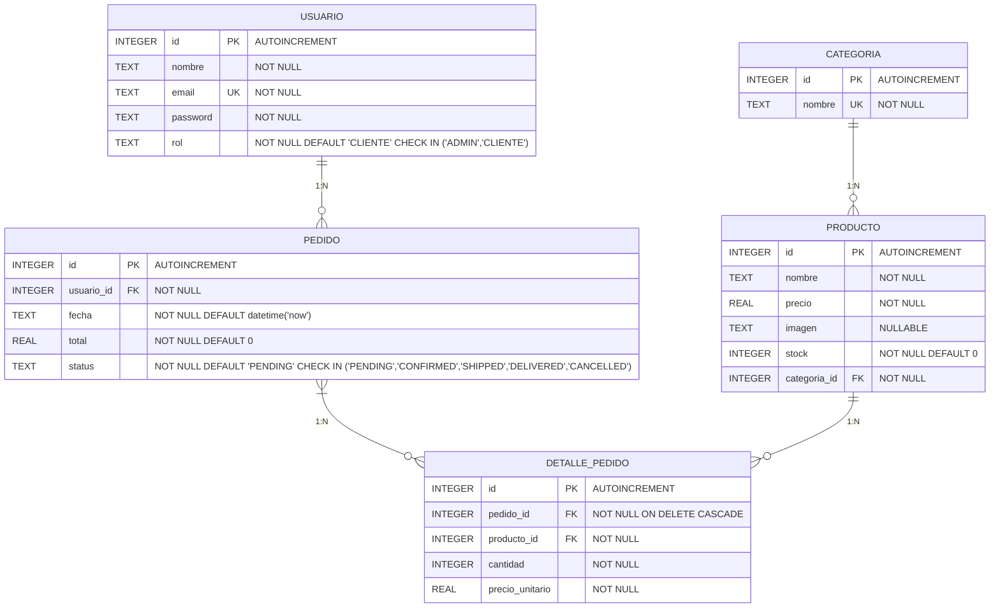
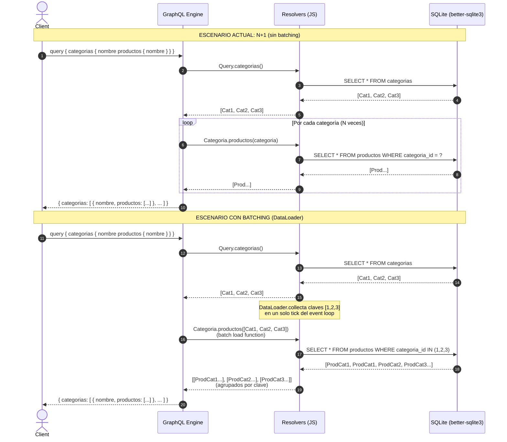

# Reporte P6 — Backend GraphQL (NexoPlay)

**Práctica P2-6** — Programación Web 2 · Parcial 2 · Semana 2  
**Modalidad:** Individual  
**Fecha:** Septiembre 2026  
**Autor:** [Tu Nombre / Legajo]  
**Repositorio:** `p26-back` (Node.js + Apollo Server 5 + SQLite)

---

## 1. Portada

| Dato | Valor |
|------|-------|
| **Materia** | Programación Web 2 (PWII) |
| **Práctica** | P2-6 — Backend GraphQL (momento P6) |
| **Proyecto** | NexoPlay |
| **Backend** | Node.js 18+ + Apollo Server 5 |
| **Base de datos** | SQLite (better-sqlite3) — archivo `nexoplay.db` generado desde `db.sql` |
| **Endpoint** | `http://localhost:4001/graphql` (Apollo Sandbox incluido) |
| **Entrega** | `db.sql` replicable + `README.md` con instrucciones |

---

## 2. Marco Teórico

### 2.1 GraphQL: Conceptos Clave
- **Un solo endpoint** (`/graphql`) que acepta `POST` con `{ query, variables }`.
- **Schema Definition Language (SDL):** tipado fuerte, introspección, documentación integrada.
- **Query** (lectura): no muta estado, cachéable, paralelizable.
- **Mutation** (escritura): ejecuta en serie, efectos secundarios, devuelve datos actualizados.
- **Input types:** agrupan argumentos de escritura (`ProductoInput`, `PedidoInput`, `DetallePedidoInput`).
- **Resolvers:** funciones que resuelven cada campo del schema; pueden ser triviales (scalar) o compuestos (relaciones).
- **Relaciones anidadas:** el cliente pide `categoria { productos { nombre } }`; el servidor resuelve `Categoria.productos` vía field resolver.
- **Problema N+1:** al resolver listas con relaciones, un resolver de campo por elemento → consultas extra. Solución: **DataLoader** (batching) o `JOIN` + agrupado en memoria.

### 2.2 Schema del Proyecto (Resumen)
```graphql
enum RolUsuario { ADMIN, CLIENTE }
enum EstadoPedido { PENDING, CONFIRMED, SHIPPED, DELIVERED, CANCELLED }

type Categoria { id: ID!, nombre: String!, productos: [Producto!]! }
type Producto  { id: ID!, nombre: String!, precio: Float!, imagen: String, stock: Int!, categoria: Categoria! }
type Usuario   { id: ID!, nombre: String!, email: String!, rol: RolUsuario!, pedidos: [Pedido!]! }
type DetallePedido { id: ID!, producto: Producto!, cantidad: Int!, precioUnitario: Float!, subtotal: Float! }
type Pedido    { id: ID!, fecha: String!, total: Float!, status: EstadoPedido!, usuario: Usuario!, detalles: [DetallePedido!]! }

input ProductoInput       { nombre: String!, precio: Float!, imagen: String, stock: Int!, categoriaId: ID! }
input DetallePedidoInput  { productoId: ID!, cantidad: Int! }
input PedidoInput         { usuarioId: ID!, detalles: [DetallePedidoInput!]! }

type Query    { categorias: [Categoria!]!, categoria(id: ID!): Categoria, productos(limite: Int, desde: Int): [Producto!]!, producto(id: ID!): Producto, pedidos: [Pedido!]! }
type Mutation { crearProducto(datos: ProductoInput!): Producto!, actualizarProducto(id: ID!, datos: ProductoInput!): Producto, eliminarProducto(id: ID!): Boolean!, crearPedido(datos: PedidoInput!): Pedido! }
```

### 2.3 Resolvers y Prepared Statements
- **Prepared statements** (`db.prepare()`) compiladas una vez en `resolvers.js:7-35` → reutilizadas, seguras contra inyección.
- **Transacción** en `crearPedido` (`db.transaction`) → atomicidad: pedido + renglones o rollback total.
- **Field resolvers** para relaciones: `Categoria.productos`, `Producto.categoria`, `Usuario.pedidos`, `Pedido.usuario`, `Pedido.detalles`, `DetallePedido.producto`.

### 2.4 Base de Datos Real
- **SQLite** (`better-sqlite3`): archivo único, cero configuración, portable.
- **`db.sql`** (sección 9 de la práctica): `DROP TABLE IF EXISTS` + `CREATE TABLE` + `INSERT` semilla.
- Auto-inicialización en `src/db.js`: si no existe `nexoplay.db`, ejecuta `db.sql` al arrancar.
- Variable `RESET_DB=true` en `.env` para reiniciar en cada arranque (desarrollo).

---

## 3. Diseño UML — Diagrama de Entidades (DER)



### 3.1 SDL Completo (`src/schema.js`)

```graphql
#graphql
  """Rol que puede tener un usuario del sistema."""
  enum RolUsuario {
    ADMIN
    CLIENTE
  }

  """Estado del ciclo de vida de un pedido."""
  enum EstadoPedido {
    PENDING
    CONFIRMED
    SHIPPED
    DELIVERED
    CANCELLED
  }

  """Categoria del catalogo (tabla categorias)."""
  type Categoria {
    id: ID!
    nombre: String!
    "Productos que pertenecen a esta categoria (resolver de campo, relacion 1-N)."
    productos: [Producto!]!
  }

  """Producto disponible en el catalogo (tabla productos)."""
  type Producto {
    id: ID!
    nombre: String!
    precio: Float!
    imagen: String
    stock: Int!
    "Categoria a la que pertenece este producto (resolver de campo, lado N de la relacion)."
    categoria: Categoria!
  }

  """Usuario que compra en la plataforma (tabla usuarios)."""
  type Usuario {
    id: ID!
    nombre: String!
    email: String!
    rol: RolUsuario!
    "Historial de pedidos de este usuario (resolver de campo, relacion 1-N)."
    pedidos: [Pedido!]!
  }

  """Un renglon del pedido: un producto con la cantidad comprada (tabla detalle_pedido)."""
  type DetallePedido {
    id: ID!
    "Producto de este renglon (resolver de campo)."
    producto: Producto!
    cantidad: Int!
    precioUnitario: Float!
    subtotal: Float!
  }

  """Pedido realizado por un usuario (tabla pedidos)."""
  type Pedido {
    id: ID!
    fecha: String!
    total: Float!
    status: EstadoPedido!
    "Usuario que realizo el pedido (resolver de campo)."
    usuario: Usuario!
    "Renglones del pedido, cada uno con su producto y cantidad (relacion N-N via detalle_pedido)."
    detalles: [DetallePedido!]!
  }

  """Datos para crear o actualizar un producto."""
  input ProductoInput {
    nombre: String!
    precio: Float!
    imagen: String
    stock: Int!
    categoriaId: ID!
  }

  """Un renglon (producto + cantidad) al armar un pedido nuevo."""
  input DetallePedidoInput {
    productoId: ID!
    cantidad: Int!
  }

  """Datos para registrar un pedido nuevo."""
  input PedidoInput {
    usuarioId: ID!
    detalles: [DetallePedidoInput!]!
  }

  """Operaciones de lectura (no cambian el estado del sistema)."""
  type Query {
    "Lista las categorias; cada una resuelve sus propios productos (consulta anidada)."
    categorias: [Categoria!]!
    "Consulta una categoria por su identificador."
    categoria(id: ID!): Categoria

    "Catalogo de productos, paginado."
    productos(limite: Int, desde: Int): [Producto!]!
    "Consulta un producto por su identificador."
    producto(id: ID!): Producto

    "Historial de pedidos registrados."
    pedidos: [Pedido!]!
  }

  """Operaciones de escritura (registran, actualizan o eliminan datos)."""
  type Mutation {
    "Registra un producto nuevo en el catalogo."
    crearProducto(datos: ProductoInput!): Producto!
    "Actualiza los datos de un producto existente."
    actualizarProducto(id: ID!, datos: ProductoInput!): Producto
    "Elimina un producto del catalogo."
    eliminarProducto(id: ID!): Boolean!

    "Registra un pedido nuevo junto con sus renglones (productos y cantidades)."
    crearPedido(datos: PedidoInput!): Pedido!
  }
```

---

## 4. Problema N+1 — Explicación y Solución

### 4.1 Qué ocurre en el código actual
En `resolvers.js:39-44` se documenta:

> ```js
> // NOTA sobre N+1: esta query trae todas las categorias con una sola
> // consulta; pero como Categoria.productos hace una consulta POR
> // categoria (ver resolver de campo abajo), listar N categorias
> // termina ejecutando 1 + N consultas. Para un catalogo pequeño esto
> // es aceptable; se documenta la solucion (batching con DataLoader o
> // un JOIN + agrupado en memoria) en el reporte de la practica.
> categorias: () => stmts.allCategorias.all(),
> ```

**Flujo real:**
1. `Query.categorias()` → `SELECT * FROM categorias` (1 query).
2. Por cada categoría devuelta, GraphQL invoca `Categoria.productos(categoria)` → `SELECT * FROM productos WHERE categoria_id = ?` (N queries).
3. Total: **1 + N consultas** para `categorias { productos { ... } }`.

Lo mismo aplica a:
- `Usuario.pedidos` → 1 + N por usuario
- `Pedido.detalles` → 1 + N por pedido
- `DetallePedido.producto` → 1 + N por renglón

### 4.2 Diagrama de Secuencia: N+1 vs Batching



### 4.3 Soluciones Viables

| Enfoque | Descripción | Complejidad |
|---------|-------------|-------------|
| **DataLoader** | Librería oficial de Facebook; agrupa claves en un mismo tick del event loop y hace una sola query `WHERE IN (...)`. Cachea por request. | Media (añadir dependencia, adaptar resolvers) |
| **JOIN + Agrupado** | Query inicial hace `JOIN categorias + productos`, luego agrupa en memoria (`Map<categoriaId, Producto[]>`). Elimina field resolver `Categoria.productos`. | Baja (solo SQL + JS), pero acopla query a forma del árbol GraphQL |
| **Subquery en SQLite** | `SELECT *, (SELECT json_group_array(...) FROM productos WHERE categoria_id = c.id) AS productos FROM categorias c` | Baja, pero específico de SQLite/JSON1 extension |

**Recomendación para producción:** **DataLoader** — desacopla el resolver del batching, reutilizable en cualquier campo, cachea duplicados, estándar en la comunidad Apollo.

---

## 5. Conclusión

El backend cumple **todos los requisitos del checklist (Sección 8)**:

- ✅ Servidor GraphQL en **un solo endpoint** (`/graphql`)
- ✅ Schema modela el **DER completo** con enums, types, inputs, queries, mutations
- ✅ **Lecturas:** categorías (anidada), categoría por ID, productos paginados, producto por ID, historial de pedidos
- ✅ **Escrituras:** CRUD productos + registrar pedido con renglones (transacción)
- ✅ **Resolvers de campo** para todas las relaciones anidadas
- ✅ **Base de datos real** SQLite + `db.sql` replicable (semilla con 3 categorías, 8 productos reales, 2 usuarios, 1 pedido)
- ✅ `README.md` con instalación, `.env`, comandos (`npm start`, `npm run dev`)
- ✅ **N+1 documentado** con explicación y diagrama de secuencia

La arquitectura **Apollo Server + better-sqlite3 + prepared statements + transacciones** es robusta, performante para el alcance y fácilmente migrable a PostgreSQL/MySQL cambiando solo el driver y el dialecto SQL. El schema es **contract-first**, versionable y autodocumentado (Apollo Sandbox).

---
